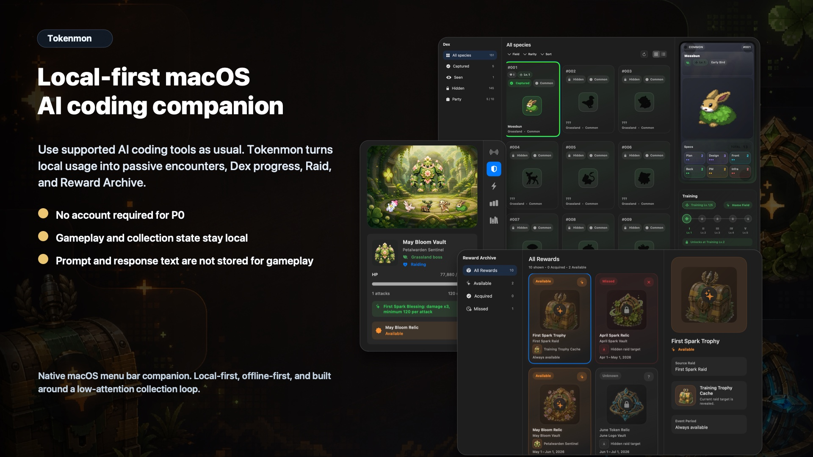
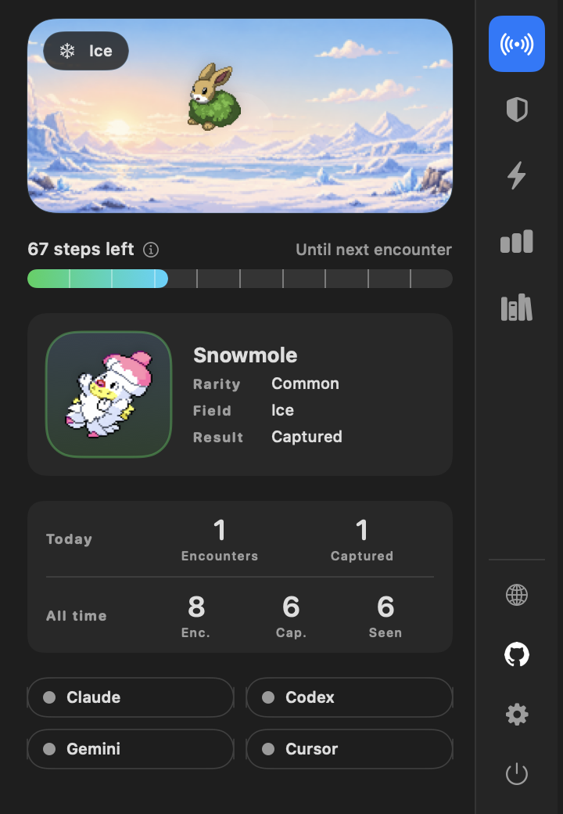
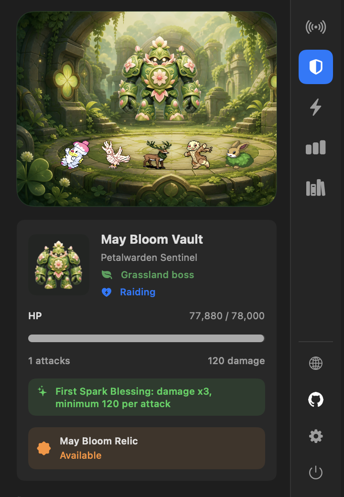
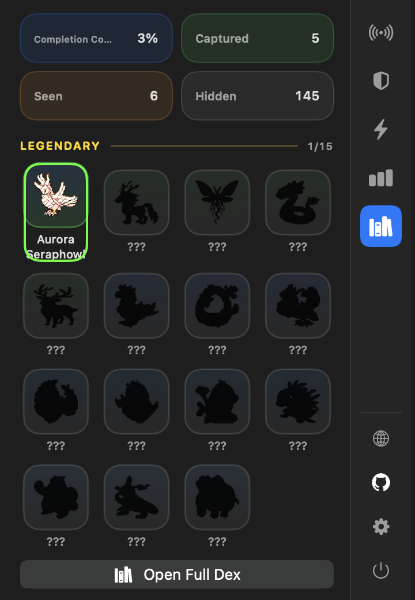
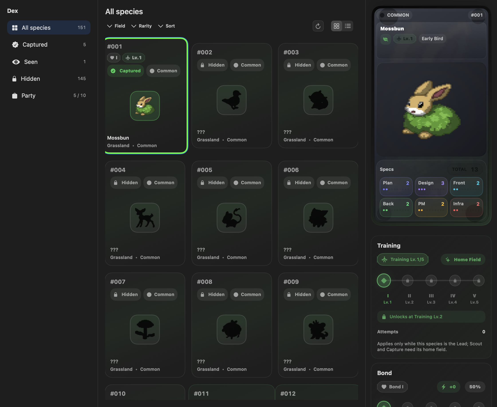
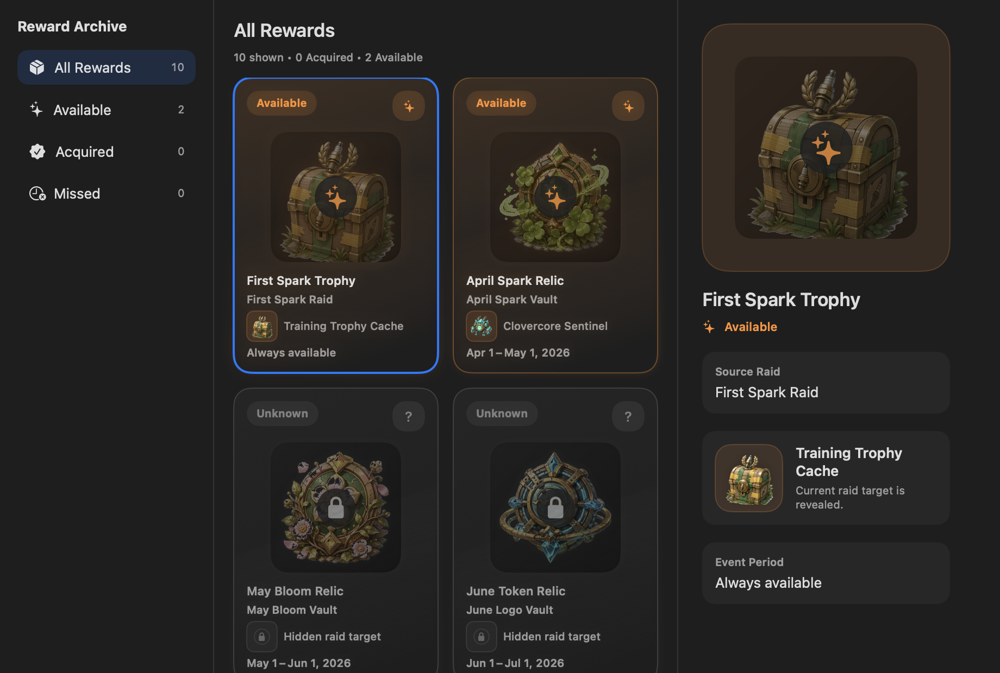
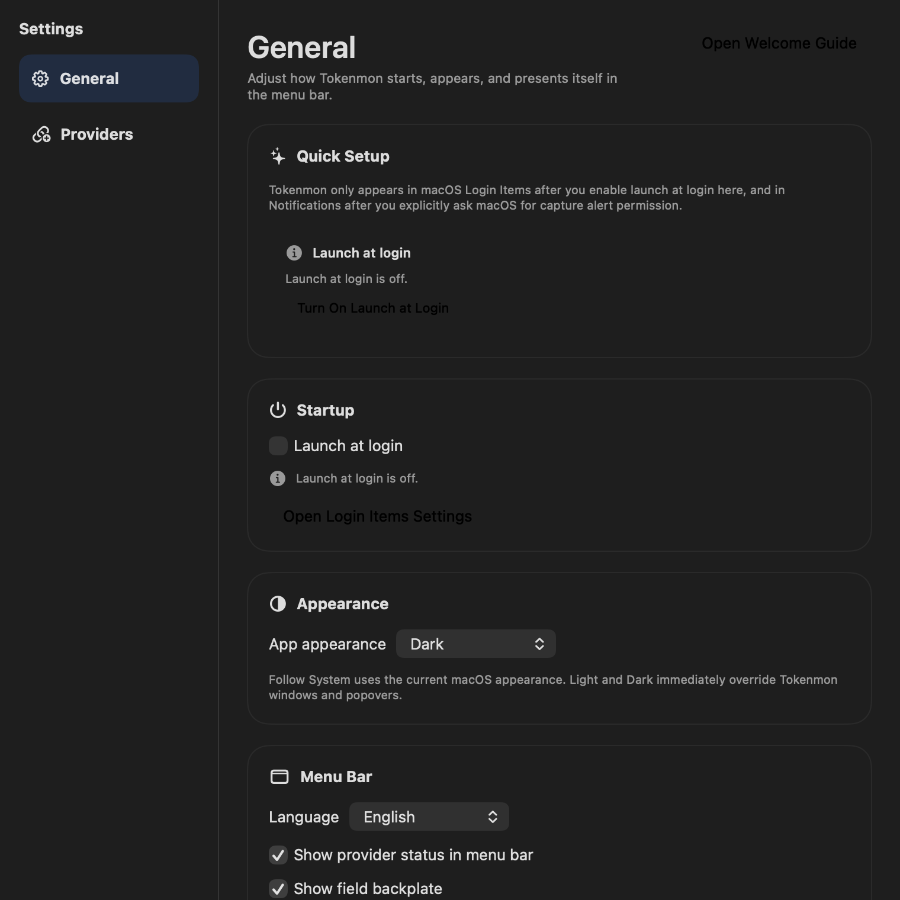

# Tokenmon

[English](README.md) | [한국어](README.ko.md)

Turn everyday AI coding into a quiet creature-collection loop.

Tokenmon is a macOS menu bar companion for people who spend their day in Claude
Code and Codex. Keep coding like normal, let exploration build in the
background, and watch new creatures appear, resolve, and fill your Dex without
asking for an account or your prompt history.

<p align="center">
  
</p>

<p align="center">
  
</p>

## Download

- [Download the latest macOS release (DMG)](https://github.com/aroido/tokenmon/releases/latest)
- Install with Homebrew:

```bash
brew install --cask aroido/tokenmon/tokenmon
```

- Requires macOS Sequoia or later

## Why People Keep It Open

- Your normal AI coding sessions become light exploration and surprise
  encounters.
- The app stays out of the way in the menu bar until you want a quick glance.
- Everything is local-first, offline-first, and designed to work without an
  account.
- Gameplay works without storing your prompt or response text.
- Release builds can update in-app, so trying Tokenmon stays low-friction.

## Screenshots

<p align="center">
  
  
  
</p>

<p align="center">
  
  
  
</p>

## Public Source Repo

- This repository is the canonical public, source-available codebase for
  Tokenmon.
- GitHub Releases, Sparkle updates, and Homebrew installs are published from
  this repository.
- External issues and pull requests should target this repository.
- Maintainer-only workflows, internal planning, original art review files, and
  private operator assets live outside this public codebase.

## Build From Source

```bash
swift build
./scripts/ai-verify --mode pr
./scripts/build-release
```

## Docs

- [Public source overview](docs/architecture/public-source-overview.md)
- [Public docs index](docs/INDEX.md)

## License

Tokenmon code is source-available under
[FSL-1.1-ALv2](LICENSE.md). Current versions are not OSI open source: the source
is available, but competing commercial use is restricted. Two years after a
version is published, that version converts to Apache 2.0.

Creative assets are licensed separately under
[LICENSE-assets.md](LICENSE-assets.md), and names/logos are governed by
[TRADEMARKS.md](TRADEMARKS.md).
